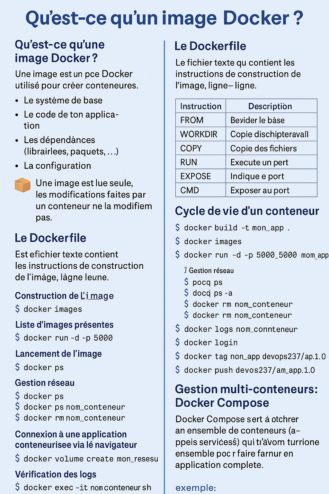

Fiche Docker

Qu’est-ce qu’une image Docker ?
Une image Docker est un modèle immuable utilisé pour créer des conteneurs. Elle contient :

Le système de base (ex: Alpine, Debian…)

Le code de ton application

Les dépendances (librairies, paquets…)

La configuration (fichiers, variables d’environnement…)

Une image est lue seule, les modifications faites par un conteneur ne la modifient pas.
Le Dockerfile est un fichier texte qui contient les instructions de construction de l’image, ligne par ligne.

Instruction	Description
```bash
FROM		# Définit l’image de base
WORKDIR		# Définit le répertoire de travail
COPY		# Copie des fichiers du host vers l’image
RUN		    # Exécute une commande pendant la construction
CMD		    # Commande exécutée au démarrage du conteneur
ENTRYPOINT	# Autre façon de définir la commande principale
ENV		    # Définit une variable d’environnement
EXPOSE		# Indique le port utilisé (documentaire)
```
Exemple:
```bash
# Image de base
FROM python:3.11-slim

# Répertoire de travail
WORKDIR /app

# Copier les fichiers
COPY requirements.txt .

# Installer les dépendances
RUN pip install --no-cache-dir -r requirements.txt

# Copier le reste du code
COPY . .

# Exposer un port
EXPOSE 5000

# Commande par défaut
CMD ["python", "app.py"]
```

Construction de l'image
```bash
docker build -t mon_app .
```

Liste des images presentent
```bash
docker images
```

Lancement de l'image
```bash
docker run -d -p 5000:5000 mon_app
```

```bash
docker ps		    # Liste conteneurs actifs
docker ps -a 		# Liste de tous les conteneurs (actifs/arretes)
docker stop nom_conteneur	# Arreter un conteneur
docker rm nom_conteneur 	# Suppression de conteneur
```

Gestion reseau
```bash
docker network create mon_reseau	# Creation reseau docker personnalise
docker run --network mon_reseau ...	# Association a un reseau
```

Creation volume
```bash
docker volume create mon_volume
docker volume ls
```

Acces conteneur
```bash
docker exec -it nom_conteneur sh   # ou bash selon la base/image choisie
```

Connexion a une application conteneurise via le navigateur
```bash
curl http://localhost:5000   /   adresse@ip:5000  # Acceder a l'application
```

Verification des logs
```bash
docker logs nom_conteneur
```

Versionner, taguer et publier une image sur repo distant (Docker Hub)
```bash
docker login
docker tag mon_app devops237/mon_app:1.0
docker push devops237/mon_app:1.0
```

Gestion multi-conteneurs: Docker Compose
Docker Compose sert à orchestrer un ensemble de conteneurs (appelés services) qui doivent fonctionner ensemble pour faire tourner une application complète.

Exemple:
```bash
version: "3.8"
services:
  api:
    build: ./api
    ports:
      - "5000:5000"

  db:
    image: postgres:15
    environment:
      POSTGRES_USER: user
      POSTGRES_PASSWORD: pass
      POSTGRES_DB: mydb
    volumes:
      - pgdata:/var/lib/postgresql/data

  nginx:
    build: ./nginx
    ports:
      - "80:80"
    depends_on:
      - api

volumes:
  pgdata:
```

Commandes utiles 
```bash
docker-compose up -d            # Démarrer en arrière-plan
docker-compose down             # Arrêter et supprimer les conteneurs
docker-compose ps               # Afficher l’état des services
docker-compose logs             # Voir les logs
docker-compose build            # Reconstruire les images
docker-compose exec nom_service sh   # Exécuter une commande dans un service
```


