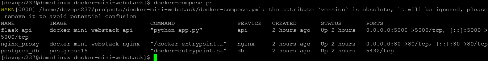

# Mini Stack Web Dockerisée : Flask + PostgreSQL + Nginx sur Arch Linux
(Installation manuelle de Docker et orchestration multi-conteneurs avec docker-compose)


```bash
sudo pacman -Syu docker docker-compose
# -S installation paquets
# -y mise a jour de la bd et rafraichit les mirroirs
# -u mise a jours paquets installes
sudo systemctl enable docker --now
```


En cas de message erreur


```bash
sudo pacman -Syu linux linux-headers # installation noyau plus compatible avec Docker
sudo reboot
```


Ajout user au groupe docker
```bash
sudo usermod -aG docker $USER
newgrp docker
docker version # verification
docker run hello-world # test deploiement conteneur
```


Creation repertoire pour notre mini app Docker
```bash
mkdir -p ~/projetcs/docker-mini-webstack/{api,nginx,db} # Creation repo parent et enfants
cd ~/projetcs/docker-mini-webstack
```

Fichier api/app.py
```bash
from flask import Flask
app = Flask(__name__)

@app.route('/')
def home():
    return "Hello from Flask in Docker!"

if __name__ == "__main__":
    app.run(host='0.0.0.0')
```

Fichier api/requirements.txt
```bash
flask==2.2.5 # version choisie
requests>=2.25.0 
```

Fichier Dockerfile
```bash
FROM python:3.11-alpine
WORKDIR /app
COPY . .
RUN pip install -r requirements.txt
CMD ["python", "app.py"]
```

Fichier nginx/default.conf
```bash
server {
        listen 80;
        location / {
                proxy_pass http://api:5000;
                proxy_set_header Host $host;
                proxy_set_header X-Real-IP $remote_addr;
     }
}
```

Fichier docker-compose.yml a la racine docker-mini-webstack/
```bash
version: "3.8"
services:
  api:
    build: ./api    # Construction de l'image a partir de notre Dockerfile
    container_name: flask_api
    ports:
      - "5000:5000"     # Port locale 5000 exposer vers le conteneur 

  db:
    image: postgres:15  # Image de PostgresSQL
    container_name: postgres_db
    environment:
      POSTGRES_USER: user
      POSTGRES_PASSWORD: password
      POSTGRES_DB: MYDB
    volumes:
      - pgdata:/var/lib/postgresql/data

  nginx:
    build: ./nginx
    container_name: nginx_proxy
    ports:
      - "80:80"     # Expose le port 80 vers l'hote
    depends_on:
      - api         # depend au prealable de l'api Flask(ready) avant de pouvoir demarrer

volumes:
  pgdata:       # volume pour la bd PostgreSQL
```

Demarrer le tout
```bash
docker-compose up -d build
```


En cas de "bonnes nouvelles", apres avoir appris d'elles 
```bash
docker-compose down -v      # Stopper et supprimer les volumes precedenment creer
docker-compose build        # Reconstruire tous les services(contenneurs)
docker-compose up -d  # Relancer tout correctement
```



Interaction conteneur
```bash
docker exec -it flask_api sh # entree conteneur Flask
docker exec -it postgres_db psql -U user -d mydb
```


Test commande BD
```bash
\l
```


Access application via navigateur
```bash
curl http://localhost:5000
# ou
curl http://192.168.100.158:5000
```
