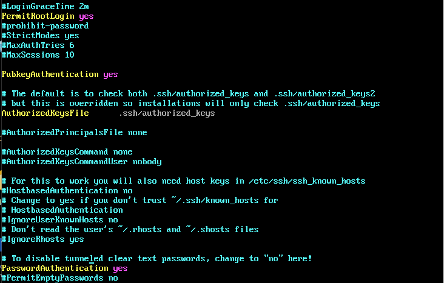

# Guide d'installation d'Arch Linux sur VirtualBox (mode BIOS + partition DOS)
Prérequis
VirtualBox installé sur votre machine hôte
Image ISO officielle Arch Linux :
```bash
 https://archlinux.org/download/
```

Avoir une connexion Internet fonctionnelle (moi j'ai la fibre de CAMTEL et toi?)

## 1. Téléchargement et démarrage
Téléchargez l'image ISO ci-dessus
Créez une VM sur VirtualBox (2 Go RAM minimum, 15 Go disque dur)
Activez une seconde carte réseau en mode Bridge, la premiere etant en NAT
Lancez la VM avec l'image ISO montée


## 2. Test de connexion Internet
```bash
ping -c 3 archlinux.org   # Envoi de trois packets pour le test
```
Si la connexion échoue :
```bash
ip link     # affiche les interfaces reseaux
# Activation du client DHCP pour forcer l'interface a recuperer @ip si cela n'est pas fait automatiquement
systemctl enable dhcpcd
systemctl status dhcpcd 
systemctl start dhcpcd.service
```


## 3. Informations sur le réseau et utilisateur actuel
```bash
ip -br a   # affiche un resume rapide des interfaces
whoami
```
## 4. Définir le mot de passe root (option SSH)
```bash
passwd
```


### Configuration des hotes 
```bash
pacstrap -S vim
vim /etc/hosts # Decommenter les lignes illustrer en image
```



Pour activer SSH (optionnel) et se connecter (Remote Desktop dans mon cas):
```bash
pacman -S openssh
systemctl enable sshd --now 
```


## 5. Partitionnement du disque
```bash
lsblk
cfdisk /dev/sda # Choisir le type "dos"
/dev/sda1 : (1G) 
/dev/sda2 : (le reste du disque)
```


## 6. Formater les partitions
```bash
mkfs.ext4 /dev/sda1
mkfs.ext4 /dev/sda2
```


## 7. Monter les partitions
```bash
mount /dev/sda2 /mnt
mkdir /mnt/boot
mount /dev/sda1 /mnt/boot
```


## 8. Installer Arch Linux
```bash
pacstrap /mnt base linux linux-firmware 
```


## 9. Générer le fichier fstab
```bash
genfstab -U /mnt >> /mnt/etc/fstab
cat /mnt/etc/fstab
```

## 10. Entrer dans le système installé
```bash
arch-chroot /mnt
```
## 11. Configuration de la langue
```bash
vim /etc/locale.gen # Décommenter: en_US.UTF-8 UTF-8
locale-gen
echo "LANG=en_US.UTF-8" > /etc/locale.conf
```

## 12. Configuration de l'heure
```bash
ln -sf /usr/share/zoneinfo/Afrique/Douala /etc/localtime
hwclock --systohc
```

## 13. Installation de GRUB (mode BIOS)
```bash
pacman -S grub
# Pour BIOS
grub-install --target=i386-pc /dev/sda
grub-mkconfig -o /boot/grub/grub.cfg
# Si vous êtes en mode UEFI, utilisez "grub-install --target=x86_64-efi --efidirectory=/
boot --bootloader-id=GRUB"
```

## 14. Quitter et redémarrer
```bash
exit
umount -R /mnt
reboot
#Retirer l'image ISO dans les paramètres de la VM avant de la redémarrer.
```

## 15. Créer un utilisateur et activer sudo
```bash
useradd -m -G wheel -s /bin/bash yourusername
passwd yourusername
EDITOR=nano visudo # Décommenter la ligne:
# %wheel ALL=(ALL:ALL) ALL
```


## (Optionnel) 16. Configuration réseau post-installation
(systemd-networkd)
Fichier : /etc/systemd/network/20-wired.network
```bash
[Match]
Name=enp0s3
[Network]
DHCP=yes
```
Ensuite
```bash
systemctl enable systemd-networkd --now
systemctl enable systemd-resolved --now
```

Fin de l'installation!
Parvenu a cette derniere etape, votre système Arch Linux(minimal) est prêt. 
Vous pouvez maintenant installer un environnement tout ce que vous voulez tel que des outils DevOps ou autres selon vos besoins à venir.